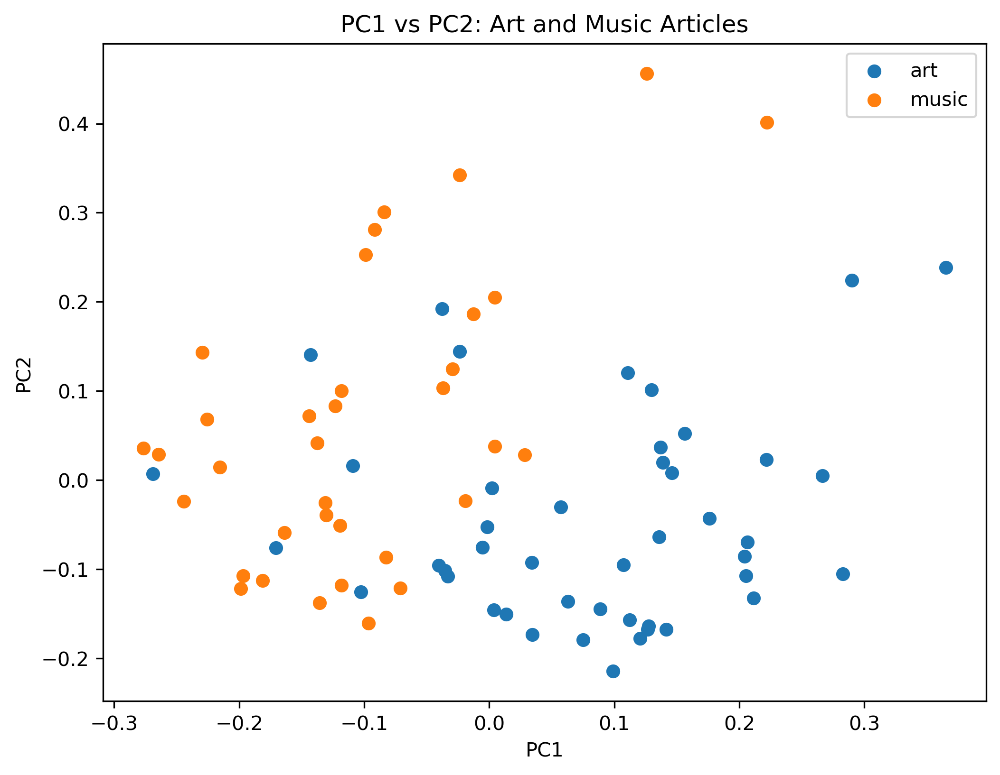

# NYTimes-Latent-Semantic-Analysis-with-PCA
Latent Semantic Analysis of New York Times articles using PCA and logistic regression to distinguish art and music stories.

# NYTimes Latent Semantic Analysis with PCA

## Overview

This project applies **Principal Component Analysis (PCA)** for latent semantic analysis of New York Times articles and uses **logistic regression** to classify articles as **art** or **music**.

The dataset contains **80 training articles, 22 test articles, and 4,431 word features**.

## PCA Visualization

The first two principal components show some separation between art and music articles, although substantial overlap remains.

## Methods

- Principal Component Analysis (PCA)
- Explained variance analysis
- PC1 vs. PC2 visualization
- Logistic Regression
- Decision boundary visualization
- Confusion matrix and class-specific error rates
- 5-fold cross-validation for selecting the number of PCs
- PCA + Logistic Regression Pipeline to prevent data leakage
- Comparison with Principal Components Regression (PCR)

## Results

| Model | Test Accuracy | Test Error |
|---|---:|---:|
| Logistic Regression with 2 PCs | 63.64% | 36.36% |
| Logistic Regression with 46 CV-selected PCs | **68.18%** | **31.82%** |

Cross-validation selected **46 principal components**. The final model correctly classified all art articles but had greater difficulty identifying music articles.

## Tools

**Python • Pandas • NumPy • Matplotlib • Scikit-learn • Jupyter Notebook**

## Conclusion

Using additional principal components selected through cross-validation modestly improved classification performance.

This project demonstrates **PCA-based dimensionality reduction, logistic regression, model evaluation, and leakage-safe cross-validation** for high-dimensional text data.
